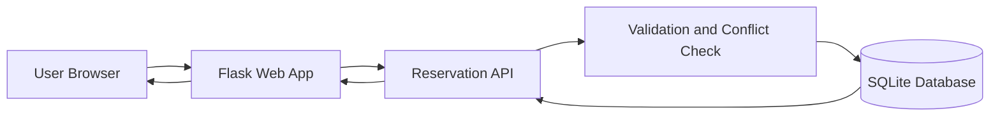
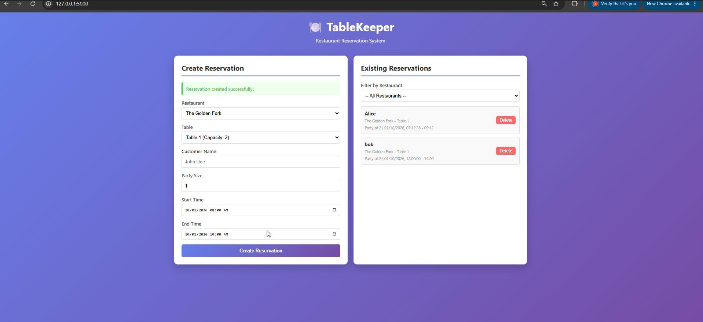
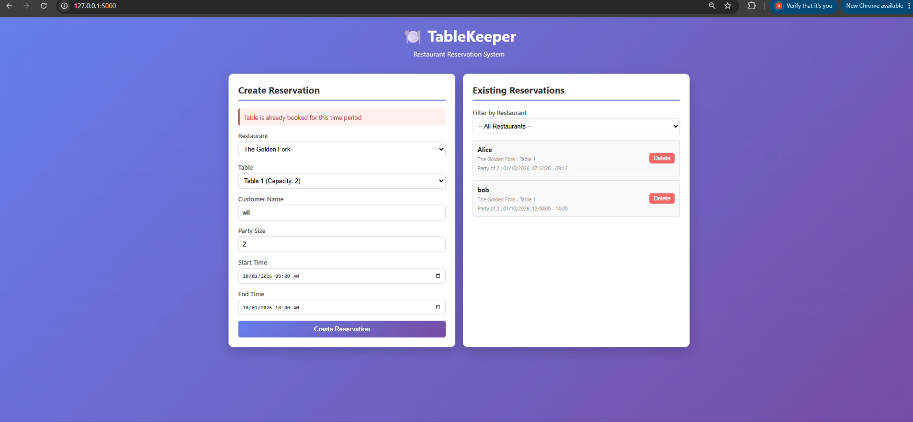
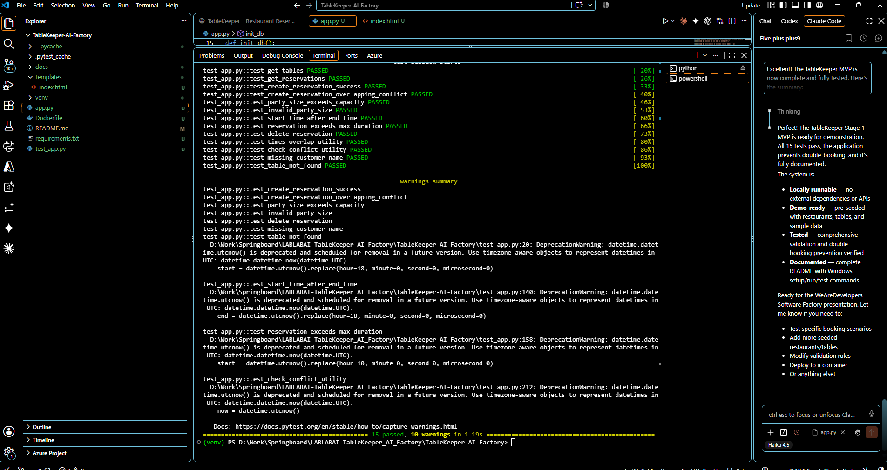

# TableKeeper - Restaurant Reservation System

A Stage 1 MVP for a restaurant reservation application that prevents double-booking. This is a demonstration application for the WeAreDevelopers "software factory" track.

## Features

- **Restaurant Management**: Support for multiple restaurants with different tables
- **Table Management**: Each restaurant has multiple tables with different capacities
- **Reservation Creation**: Book tables with customer name, party size, and time slot
- **Double-Booking Prevention**: Automatically rejects overlapping reservations for the same table
- **Validation**: Enforces business logic:
  - Party size must not exceed table capacity
  - Start time must be before end time
  - Reservations limited to 4 hours maximum
  - Party size must be 1-20 people
- **Real-time Reservation View**: See all existing reservations with delete capability
- **Seeded Data**: Pre-populated with sample restaurants and tables for immediate testing

## Tech Stack

- **Backend**: Python 3.x with Flask
- **Database**: SQLite (local, no setup required)
- **Frontend**: HTML5, CSS3, Vanilla JavaScript
- **Testing**: pytest
- **Deployment**: Docker-ready (Dockerfile included)

## Architecture



## Setup & Installation (Windows)

### Prerequisites

- Python 3.8+ installed
- Windows PowerShell or Command Prompt

### Step 1: Create Virtual Environment

```powershell
python -m venv venv
venv\Scripts\Activate.ps1
```

### Step 2: Install Dependencies

```powershell
pip install -r requirements.txt
```

### Step 3: Verify Installation

```powershell
pip list
```

You should see Flask, pytest, and Werkzeug listed.

## Running the Application

### Start the Development Server

```powershell
python app.py
```

The server will start with output like:
```
 * Running on http://127.0.0.1:5000
```

### Access the Application

Open your browser and navigate to:
```
http://localhost:5000
```

### Stop the Server

Press `Ctrl+C` in the PowerShell window.

## Testing

Run all tests with pytest:

```powershell
pytest test_app.py -v
```

### Test Coverage

The test suite includes:

1. **UI Tests**
   - Index page loads correctly

2. **API Tests**
   - Get restaurants list
   - Get tables for a restaurant
   - Get all reservations

3. **Successful Booking Test**
   - Create a new reservation on an available table

4. **Double-Booking Prevention Test** ✓
   - Create a reservation
   - Attempt to create overlapping reservation (should fail with 409 conflict)

5. **Validation Tests**
   - Party size exceeds table capacity
   - Invalid party size (0 or > 20)
   - Start time after end time
   - Reservation exceeds 4-hour maximum
   - Missing customer name
   - Non-existent table

6. **Delete Reservation Test**
   - Create and delete a reservation successfully

7. **Utility Function Tests**
   - Time overlap detection
   - Conflict checking logic

### Expected Test Output

```
test_app.py::test_index_page PASSED
test_app.py::test_get_restaurants PASSED
test_app.py::test_get_tables PASSED
test_app.py::test_get_reservations PASSED
test_app.py::test_create_reservation_success PASSED
test_app.py::test_create_reservation_overlapping_conflict PASSED
test_app.py::test_party_size_exceeds_capacity PASSED
test_app.py::test_invalid_party_size PASSED
test_app.py::test_start_time_after_end_time PASSED
test_app.py::test_reservation_exceeds_max_duration PASSED
test_app.py::test_delete_reservation PASSED
test_app.py::test_times_overlap_utility PASSED
test_app.py::test_check_conflict_utility PASSED
test_app.py::test_missing_customer_name PASSED
test_app.py::test_table_not_found PASSED

======================== 15 passed in X.XXs ========================
```

## Demo Walkthrough

### 1. Create a reservation

Choose a restaurant and table, enter the customer details and time slot, then submit the reservation. The reservation appears immediately in the existing reservations list.



### 2. Prevent double-booking

If another reservation overlaps the same table and time period, the application rejects it and displays a clear error message.



### 3. Verify the application

The automated pytest suite validates the API, reservation creation, overlap detection, capacity limits, time validation, deletion, and utility functions.



## Application Structure

```
TableKeeper-AI-Factory/
├── app.py                 # Flask application and database logic
├── test_app.py           # pytest test suite (15 tests)
├── requirements.txt      # Python dependencies
├── Dockerfile            # Docker configuration
├── README.md             # This file
└── templates/
    └── index.html        # Web UI (HTML/CSS/JavaScript)
```

## Database Schema

### Tables

- **restaurants**: id, name, timezone
- **tables**: id, restaurant_id, table_number, capacity
- **reservations**: id, table_id, party_size, start_time, end_time, customer_name

### Seeded Data

**Restaurants:**
- The Golden Fork (3 tables: 2, 4, 6 capacity)
- Sunset Bistro (2 tables: 2, 4 capacity)

**Sample Reservation:**
- Alice's reservation on The Golden Fork Table 1 (current time + 2 hours)

## API Endpoints

### GET /api/restaurants
Returns all restaurants

### GET /api/tables/<restaurant_id>
Returns all tables for a restaurant

### GET /api/reservations
Returns all reservations (supports filtering by restaurant_id or table_id)

### POST /api/reservations
Create a new reservation

**Request body:**
```json
{
  "table_id": 2,
  "customer_name": "John Doe",
  "party_size": 4,
  "start_time": "2026-10-01T18:00:00",
  "end_time": "2026-10-01T20:00:00"
}
```

**Error Responses:**
- `400`: Invalid input, party size exceeds capacity, invalid time range
- `404`: Table not found
- `409`: Table already booked for the time period (double-booking prevention)

### DELETE /api/reservations/<reservation_id>
Delete a reservation

## Docker Setup

### Build the Image

```powershell
docker build -t tablekeeper:latest .
```

### Run the Container

```powershell
docker run -p 5000:5000 tablekeeper:latest
```

The application will be available at `http://localhost:5000`

## Railway Deployment

### Overview

TableKeeper is optimized for Railway Serverless/App Sleeping with minimal resource usage:

- **Embedded Database**: SQLite database is embedded in the Flask process—no external service required
- **No Volumes**: The application uses an ephemeral database that resets on deployment (suitable for demo)
- **No Background Jobs**: No polling, scheduled tasks, or background processes
- **Connection Management**: One database connection per request, properly closed after use
- **Production Configuration**: Debug mode is automatically disabled in production

### Deployment Steps

1. **Connect Repository**
   - Push this repository to GitHub
   - Connect it to Railway via the Railway dashboard

2. **Environment Configuration**
   - Set `FLASK_ENV=production` (default via `os.getenv('FLASK_ENV', 'production')`)
   - Set `FLASK_DEBUG=false` (default; only set to `true` for troubleshooting)
   - Railway automatically exposes port via `PORT` environment variable

3. **No Configuration Required**
   - SQLite database initializes automatically on startup
   - No database migration or setup scripts needed
   - Flask debug mode is disabled by default

### Low Usage Characteristics

- **Ephemeral Database**: Database resets on each deployment (fine for demo, not for production persistence)
- **No Persistent Volumes**: No volume mount required or used
- **Serverless Sleep**: App will sleep when idle, consuming minimal resources
- **Automatic Startup**: Database initializes instantly on request

### Production Considerations

For production use, consider:
- Persistent volume mount for SQLite (if data retention needed)
- Or migrate to PostgreSQL/MySQL with external database service
- Add monitoring and logging
- Enable HTTPS and authentication
- Set `FLASK_DEBUG=false` explicitly in production

## Double-Booking Prevention Logic

The application prevents double-booking through:

1. **Overlap Detection**: The `times_overlap()` function checks if two time intervals intersect
2. **Conflict Checking**: Before creating a reservation, the `check_conflict()` function queries all existing reservations for the table
3. **HTTP 409 Response**: If a conflict is detected, the API returns a 409 Conflict status with a clear error message

**Example:**
- Reservation 1: 18:00 - 20:00 (6:00 PM - 8:00 PM)
- Reservation 2 (rejected): 18:30 - 20:30 (6:30 PM - 8:30 PM) — overlaps with Reservation 1
- Reservation 3 (allowed): 20:00 - 22:00 (8:00 PM - 10:00 PM) — no overlap

## Troubleshooting

### Port Already in Use

If port 5000 is already in use, modify the last line in `app.py`:
```python
app.run(debug=True, port=5001)  # Use 5001 instead
```

### Database Corruption

The database is automatically recreated each time `app.py` runs. To manually reset:
```powershell
Remove-Item tablekeeper.db -Force
```

### Virtual Environment Issues

Deactivate and reactivate:
```powershell
deactivate
venv\Scripts\Activate.ps1
```

## Development Notes

- **Flask Configuration**: Debug mode is disabled by default for production. Enable locally with `set FLASK_DEBUG=true` (Windows) or `export FLASK_DEBUG=true` (Unix), then `python app.py`
- **Environment Variables**:
  - `FLASK_ENV`: Set to `production` by default (use `development` for local debugging with auto-reload)
  - `FLASK_DEBUG`: Set to `false` by default (set to `true` to enable debug mode and auto-reload)
  - `PORT`: Defaults to 5000, automatically set by Railway
- **SQLite Database**: File-based, stored in working directory, automatically initialized on startup
- **UI**: Vanilla JavaScript with no external dependencies (except Flask on backend)
- **Validation**: All business logic validated server-side for security
- **Timestamps**: Stored in ISO 8601 format with UTC timezone awareness

## Dark Factory Submission Evidence

This repository is a complete submission for the **WeAreDevelopers x BAND "Dark Factory"** hackathon challenge.

### Factory Documentation

- **[FACTORY.md](FACTORY.md)** — Complete explanation of the five-seat BAND team structure (Planner, Implementer, Test Author, Reviewer, Integrator), handoff sequence, mandate design, verification evidence gates, and recovery process

- **[mandates/](mandates/)** — Generic standing instructions for each role:
  - [planner.md](mandates/planner.md) — Task specification and acceptance criteria
  - [implementer.md](mandates/implementer.md) — Clean code and implementation standards
  - [test_author.md](mandates/test_author.md) — Verification and acceptance testing
  - [reviewer.md](mandates/reviewer.md) — Code quality, security, and architecture review
  - [integrator.md](mandates/integrator.md) — Merging, deployment, and release management

### Buildable Stage 1 Service

- **[stage-1/](stage-1/)** — Complete, tested, deployable TableKeeper service
  - [stage-1/app.py](stage-1/app.py) — Flask application with SQLite
  - [stage-1/test_app.py](stage-1/test_app.py) — 15 automated tests
  - [stage-1/requirements.txt](stage-1/requirements.txt) — Dependencies
  - [stage-1/Dockerfile](stage-1/Dockerfile) — Container image
  - [stage-1/templates/index.html](stage-1/templates/index.html) — Web UI
  - [stage-1/README.md](stage-1/README.md) — Build and run instructions

### Verification Evidence

- **[verify_clean_container.ps1](verify_clean_container.ps1)** — Script to build Docker image and verify deployment readiness

### Test Suite Results

Run the full automated test suite:
```powershell
pytest stage-1/test_app.py -v
# Expected: 15 passed
```

### BAND Room Export

- **[band-export/](band-export/)** — Placeholder for BAND Desktop room session export

### How to Verify

1. **Test the service locally:**
   ```powershell
   cd stage-1
   python -m venv venv
   venv\Scripts\Activate.ps1
   pip install -r requirements.txt
   pytest test_app.py -v
   ```

2. **Verify Docker deployment:**
   ```powershell
   .\verify_clean_container.ps1
   ```

3. **Review factory structure:**
   - Read [FACTORY.md](FACTORY.md)
   - Review [mandates/](mandates/)
   - Check [stage-1/](stage-1/)

## License

Created for WeAreDevelopers Software Factory Demonstration - October 2026

## Support

For issues or questions about this demonstration, refer to the comprehensive test suite in `test_app.py` for usage examples.
